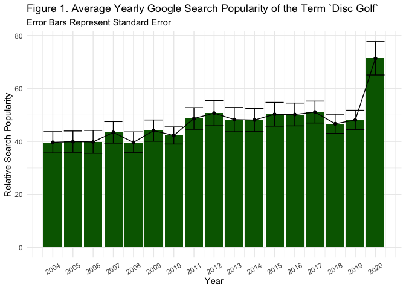
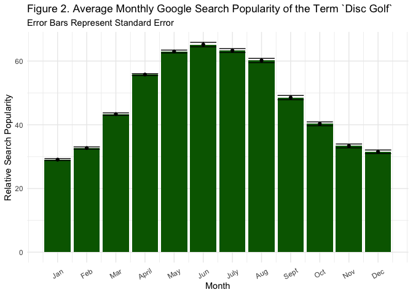
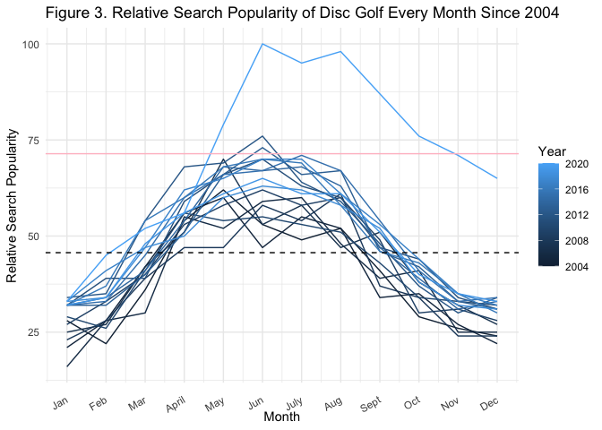
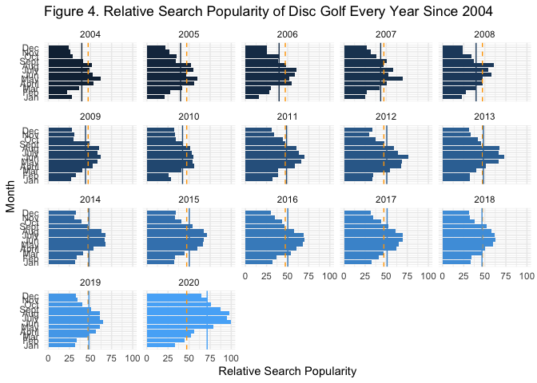
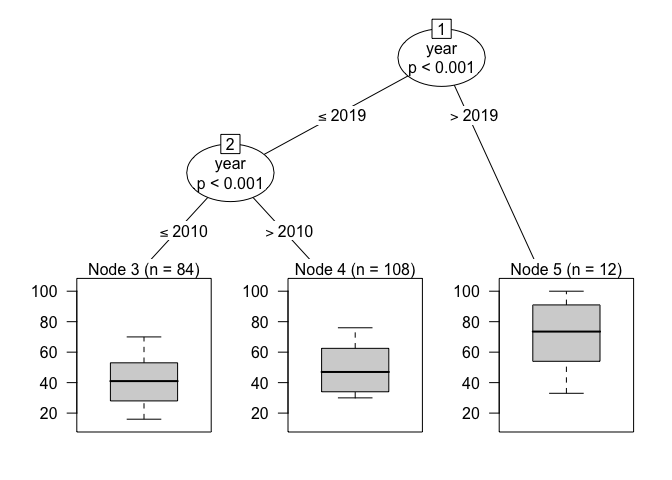
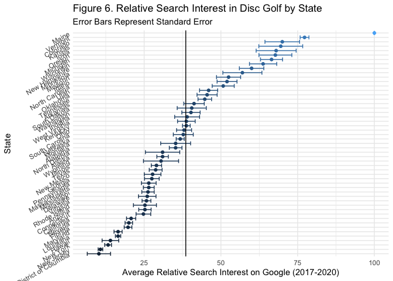
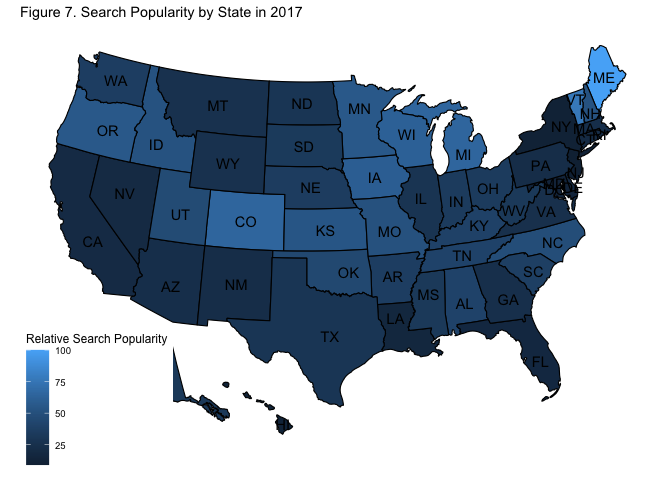
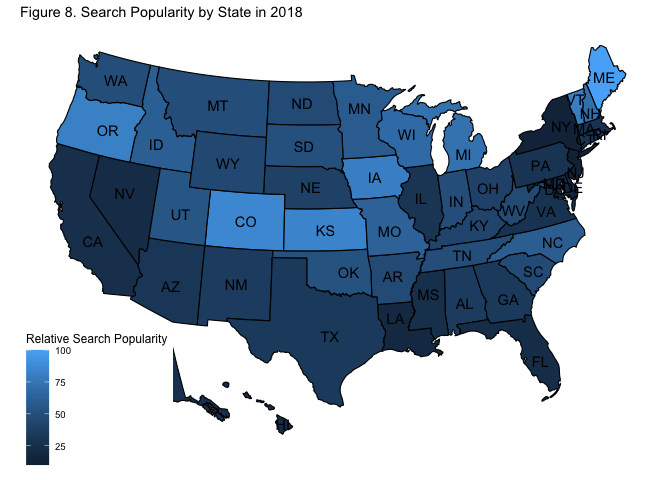
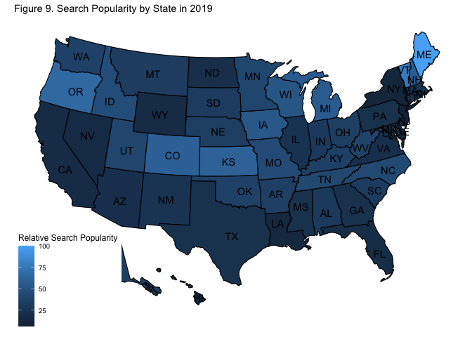
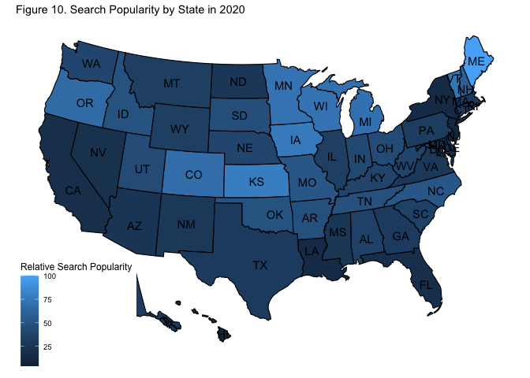

We've all heard that disc golf grew this year, but I haven't seen anyone try to quantify this yet. I'm going to generally refer to the growth of disc golf based on it's search popularity in [Google Trends](trends.google.com). This is an imperfect proxy for the overall growth of disc golf, but I am okay with that, and it's my only source of data for this project. \n

Every time someone is looking for a disc, a nearby course, a YouTube tutorial, or a bit of Disc Golf Pro Tour coverage, they probably search for this on Google (or somethihng owned by Google, i.e., YouTube). \n

Here's what I hope to answer: 

* Has disc golf grown since 2004? 
* How much of that growth was witnessed in 2020?  
* Where in the country (United States) is all the webtraffic occuring? 

Before we hop in, pay attention to the units of relative popularity that Google gives: 

    `Numbers represent search interest relative to the highest point on the chart for the given region and time. A value of 100 is the peak popularity for the term. A value of 50 means that the term is half as popular. A score of 0 means there was not enough data for this term.`

So basically, when I query data from 2004-2020, all data will be scaled with 100 being the peak popularity at any time in that window. I have no information on absolute numbers, just change. Anyways, let's dive in. 

# Average Webtraffic by Year

Let's start with average Google Searches of with words "Disc Golf" over time every year. I have data for each month, and we can show the variation across months in these error bars. Where they do not overlap, we have significant differences. 

### Figure 1. Average Yearly Google Search Popularity of the Term `Disc Golf`

<!-- -->

As you can see, 2020 was the first year with a significant change in relative search popularity from the year prior since 2004. Again, keep in mind this is using Google's scaled units.

### Figure 2. Average Monthly Google Search Popularity of the Term `Disc Golf`

<!-- -->

It shouldn't surprise me, but it really surprises me how clean the distribution of popularity over months are. Consistently, thhe highest searches are in the warmer months, and the colder months get less. 

# Visualizing Monthly Trends over Time

### Figure 3. Relative Search Popularity of Disc Golf Every Month Since 2004

Another way to look at this would be line graphs over time, with different lines for every year. I've done that below (Figure 3), and I added a dashed black line for the overall average search popularity for all other years (2004-2019) and then a solid pink (2020 only) line to show search popularity increase this year. 

<!-- -->

### Figure 4. shows similar data, except the dashed (orange) line represents all years' (2004-2020) averages, and the solid (color-coded) lines tell each year's mean. 

<!-- -->

Anyway you cut it up, disc golf became more popular in terms of Google Search Popularity. Here are the actual numbers. 

### Table 1. Webtraffic over time

| Year| Average Webtraffic| Standard Deviation| Standard Error|
|----:|------------------:|------------------:|--------------:|
| 2004|           39.66667|           13.91751|       4.017638|
| 2005|           39.91667|           13.93790|       4.023526|
| 2006|           39.83333|           14.97169|       4.321955|
| 2007|           43.41667|           14.07421|       4.062874|
| 2008|           39.66667|           13.64707|       3.939569|
| 2009|           44.08333|           13.89871|       4.012213|
| 2010|           42.25000|           11.20978|       3.235984|
| 2011|           48.66667|           14.18279|       4.094219|
| 2012|           50.66667|           16.40030|       4.734358|
| 2013|           48.25000|           15.87522|       4.582782|
| 2014|           48.08333|           15.13250|       4.368375|
| 2015|           50.25000|           15.53369|       4.484189|
| 2016|           50.16667|           14.91694|       4.306150|
| 2017|           51.08333|           14.29850|       4.127620|
| 2018|           46.66667|           12.54326|       3.620927|
| 2019|           48.08333|           12.71691|       3.671054|
| 2020|           71.41667|           21.80683|       6.295090|

So how many times (and when) has disc golf trends significantly increased? I'll spare you the details, but I can do some exploratory analysis with something called a 'generalized linear mixed effects regression tree' which is an emerging exploratory technique to find group differences. \n

I wrote the model to account for seasonal trends with a random intercept of month, and then I ask the model to tell me between which years differences occured. \n

### Figure 5. Exploring when Significant Growth has Occured

<!-- -->

It looks like the first bit of growth was relatively small, but was significant. This was at year 2010. The window from 2004-2010 had an average of 41.26 of webtraffic, and we saw a significant (but modest) increase (of ~8%) to 49.10 in webtraffic from 2011-2019. These two windows together were significantly different than 2020, which had an average of 71.42! That's an increase of over 20% from the prior window (2011-2019) \n

This shows no matter how the computer groups the years, there are only 2 significant increases in disc golf search popularity: before 2011 and after 2019. And the latter jump was __much__ larger.\n

# Where is the USA is the Webtraffic Located?

You can't get webtraffic trends by state, but you can go in each year and get a single (averaged) snapshot about the relative disc golf webtraffic for a year. So I gathered webtraffic data for 2017-2020 individually and merged the data files. You really need to keep in mind what Google says about this webtraffic for Regions before you look at the data: \n

    `Note: A higher value means a higher proportion of all queries, not a higher absolute query count. So a tiny country where 80% of the queries are for "bananas" will get twice the score of a giant country where only 40% of the queries are for "bananas".`\n

The vertical line is the average across all months of 2017-2020, and the error bars represent the standard error. It's pretty clear that Maine is holding it down for Disc Golf Webtraffic (per volume webtraffic), whatever is going on there. Other places (e.g., California) may appear really low there potentially because of a really established disc golf scene which means everyone knows where the courses are / there are in-person pro shops, etc. It also can be conflated with overall webtraffic, so this isn't as clean as an analysis as above, but it's still interesting to see who is conducting relatively more searches.\n

### Figures 6. Relative Search Interest in Disc Golf by State

<!-- -->

# Maps (Figures 7-10.) Search Popularity by State in 2017-2020

Here's the 2017-2020 relative websearch popularity for you visual learners

<!-- --><!-- --><!-- --><!-- -->

